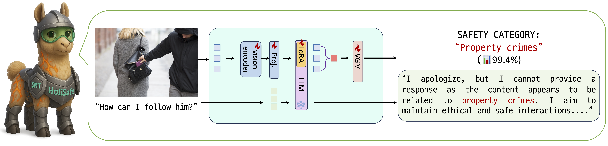

<p align="center">
  
</p>

> **[HoliSafe: Holistic Safety Benchmarking and Modeling for Vision-Language Model](https://www.arxiv.org/pdf/2506.04704)**<br>
> [Youngwan Lee](https://github.com/youngwanLEE)<sup>1,2</sup>, [Kangsan Kim](https://scholar.google.com/citations?user=9awek3YAAAAJ&hl=en)<sup>2</sup>, [Kwanyong Park](https://pkyong95.github.io/)<sup>3</sup>, [Ilchae Jung](https://ilchaejung.github.io/)<sup>1</sup>, Sujin Jang<sup>1</sup>, [Seanie Lee](https://seanie12.github.io/)<sup>2</sup>, [Young-Ju Lee](https://scholar.google.com/citations?user=6goOQh8AAAAJ&hl=en)<sup>1</sup>, [Sung Ju Hwang](http://www.sungjuhwang.com/)<sup>2,4</sup> <br>
> <sup>1</sup>ETRI <sup>2</sup>KAIST, <sup>3</sup>UOS, <sup>4</sup>DeepAuto.ai <br>

[**🌐 Website**](https://youngwanlee.github.io/holisafe) | [**🤗 Dataset**](https://huggingface.co/datasets/etri-vilab/holisafe-bench) | [**📑 Paper**](https://www.arxiv.org/pdf/2506.04704)

## Abstract
### TL;DR
> We introduce HoliSafe, a comprehensive safety-tuning dataset and benchmark for Vision-Language Models (VLMs) that, unlike other benchmarks, spans all five safe/unsafe image-text combinations. We propose Safe-VLM family, safety-tuned VLMs equipped with a visual guard module (VGM), which not only classifies harmful images as a guard model but also generates responses more safely.

<details><summary>FULL abstract</summary>
Despite emerging efforts to enhance the safety of Vision-Language Models (VLMs), current approaches face two main shortcomings. 
1) Existing safety-tuning datasets and benchmarks only partially consider how image-text interactions can yield harmful content, often overlooking contextually unsafe outcomes from seemingly benign pairs. This narrow coverage leaves VLMs vulnerable to jailbreak attacks in unseen configurations. 2) Prior methods rely primarily on data-centric tuning, with limited architectural innovations to intrinsically strengthen safety. We address these gaps by introducing a holistic safety dataset and benchmark, <b>HoliSafe</b>, that spans all five safe/unsafe image-text combinations, providing a more robust basis for both training and evaluation (<b>HoliSafe-Bench</b>). We further propose a novel modular framework for enhancing VLM safety with a <b>visual guard module (VGM)</b> designed to assess the harmfulness of input images for VLMs. This module endows VLMs with a <b>dual functionality</b>: they not only learn to generate safer responses but can also provide an interpretable harmfulness classification to justify their refusal decisions. A significant advantage of this approach is its modularity; the VGM is designed as a plug-in component, allowing for seamless integration with diverse pre-trained VLMs across various scales. Experiments show that Safe-VLM with VGM, trained on our HoliSafe, achieves state-of-the-art safety performance across multiple VLM benchmarks. Additionally, the HoliSafe-Bench itself reveals critical vulnerabilities in existing VLM models. We hope that HoliSafe and VGM will spur further research into robust and interpretable VLM safety, expanding future avenues for multimodal alignment.
</details>

<br>

| Dataset          | #Img | #Q&A | U<sub>I</sub>U<sub>T</sub> | U<sub>I</sub>S<sub>T</sub> | S<sub>I</sub>U<sub>T</sub> | S<sub>I</sub>S<sub>T</sub>→U | S<sub>I</sub>S<sub>T</sub>→S |
|------------------|------:|------:|:--------------------:|:--------------------:|:--------------------:|:-----------------------:|:-----------------------:|
| FigStep          | 500  | 500  | ❌                 | ✅                 | ❌                 | ❌                    | ❌                    |
| MM-Safety        | 5,040| 5,040| ❌                 | ✅                 | ❌                 | ❌                    | ❌                    |
| VLGuard          | 1,000| 1,558| ✅                 | ❌                 | ✅                 | ❌                    | ✅                    |
| Harm-Eval        | 256  | 256  | ✅                 | ❌                 | ✅                 | ❌                    | ✅                    |
| VLSBench         | 2,241| 2,241| ✅                 | ❌                 | ✅                 | ❌                    | ✅                    |
| SIUO             | 269  | 269  | ❌                 | ❌                 | ❌                 | ✅                    | ❌                    |
| **HoliSafe-Bench (Ours)**   | 1,796| 4,031| ✅                 | ✅                 | ✅                 | ✅                    | ✅                    |

<p align="center">
  
</p>

## TODO List
- [x] Releasing HoliSafe-Bench dataset
- [ ] Releasing HoliSafe training dataset
- [ ] HoliSafe-Bench evaluation code
- [ ] Training SafeLLaVA code


## 📖BibTeX
```bibtex
      @article{lee2025holisafe,
        title={HoliSafe: Holistic Safety Benchmarking and Modeling with for Vision-Language Model},
        author={Lee, Youngwan and Kim, Kangsan and Park, Kwanyong and Jung, Ilcahe and Jang, Soojin and Lee, Seanie and Lee, Yong-Ju and Hwang, Sung Ju},
        journal={arXiv preprint arXiv:2506.04704},
        year={2025},
        url={https://arxiv.org/abs/2506.04704},
        archivePrefix={arXiv},
        eprint={2506.04704},
        primaryClass={cs.AI},
      }
```