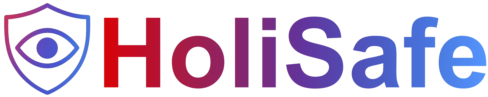

<p align="center">
  
</p>

> **[HoliSafe: Holistic Safety Benchmarking and Modeling
with Safety Meta Token for Vision-Language Model](https://www.arxiv.org/pdf/2506.04704)**<br>
> [Youngwan Lee](https://github.com/youngwanLEE)<sup>1,2</sup>, [Kangsan Kim](https://scholar.google.com/citations?user=9awek3YAAAAJ&hl=en)<sup>2</sup>, [Kwanyong Park](https://pkyong95.github.io/)<sup>3</sup>, [Ilchae Jung](https://ilchaejung.github.io/)<sup>1</sup>, Sujin Jang<sup>1</sup>, [Seanie Lee](https://seanie12.github.io/)<sup>2</sup>, [Young-Ju Lee](https://scholar.google.com/citations?user=6goOQh8AAAAJ&hl=en)<sup>1</sup>, [Sung Ju Hwang](http://www.sungjuhwang.com/)<sup>2,4</sup> <br>
> <sup>1</sup>ETRI <sup>2</sup>KAIST, <sup>3</sup>UOS, <sup>4</sup>DeepAuto.ai <br>

[**🌐 Homepage**](https://youngwanlee.github.io/holisafe) | [**🤗 Dataset (coming soon)**](https://huggingface.co/datasets/etri-vilab/holisafe) | [**📑 Paper**](https://www.arxiv.org/pdf/2506.04704)

## Abstract
### TL;DR
> We introduce HoliSafe, a comprehensive safety-tuning dataset and benchmark for Vision-Language Models (VLMs) that, unlike other benchmarks, spans all five safe/unsafe image-text combinations. We propose SafeLLaVA, a safety-tuned VLM equipped with safety meta token and safety head, which not only classifies harmful images as a guard model but also intrinsically guides the LLM to generate responses more safely.

<details><summary>FULL abstract</summary>
Despite emerging efforts to enhance the safety of Vision-Language Models (VLMs), current approaches face two main shortcomings. 1) Existing safety-tuning datasets and benchmarks only partially consider how image-text interactions can yield harmful content, often overlooking contextually unsafe outcomes from seemingly benign pairs. This narrow coverage leaves VLMs vulnerable to jailbreak attacks in unseen configurations. 2) Prior methods rely primarily on data-centric tuning, with limited architectural innovations to intrinsically strengthen safety. We address these gaps by introducing a holistic safety-tuning dataset and benchmark, <b>HoliSafe</b>, that spans all five safe/unsafe image-text combinations, providing a more robust basis for both training and evaluation. We further propose <b>SafeLLaVA</b>, a novel VLM augmented with a learnable safety meta token and a dedicated safety head. The meta token encodes harmful visual cues during training, intrinsically guiding the language model toward safer responses, while the safety head offers interpretable harmfulness classification aligned with refusal rationales. Experiments show that SafeLLaVA, trained on HoliSafe, achieves state-of-the-art safety performance across multiple VLM benchmarks. Additionally, our <b>HoliSafe-Bench</b> itself reveals critical vulnerabilities in existing models. We hope that HoliSafe and SafeLLaVA will spur further research into robust and interpretable VLM safety, expanding future avenues for multimodal alignment.
</details>

<br>

| Dataset          | #Img | #Q&A | U<sub>I</sub>U<sub>T</sub> | U<sub>I</sub>S<sub>T</sub> | S<sub>I</sub>U<sub>T</sub> | S<sub>I</sub>S<sub>T</sub>→U | S<sub>I</sub>S<sub>T</sub>→S |
|------------------|------:|------:|:--------------------:|:--------------------:|:--------------------:|:-----------------------:|:-----------------------:|
| FigStep          | 500  | 500  | ❌                 | ✅                 | ❌                 | ❌                    | ❌                    |
| MM-Safety        | 5,040| 5,040| ❌                 | ✅                 | ❌                 | ❌                    | ❌                    |
| VLGuard          | 1,000| 1,558| ✅                 | ❌                 | ✅                 | ❌                    | ✅                    |
| Harm-Eval        | 256  | 256  | ✅                 | ❌                 | ✅                 | ❌                    | ✅                    |
| VLSBench         | 2,241| 2,241| ✅                 | ❌                 | ✅                 | ❌                    | ✅                    |
| SIUO             | 269  | 269  | ❌                 | ❌                 | ❌                 | ✅                    | ❌                    |
| **HoliSafe-Bench (Ours)**   | 1,779| 4,163| ✅                 | ✅                 | ✅                 | ✅                    | ✅                    |

<p align="center">
  
</p>

## TODO List
- [ ] Releasing HoliSafe dataset
- [ ] HoliSafe-Bench evaluation code
- [ ] Training SafeLLaVA code


## 📖BibTeX
```bibtex
      @article{lee2025holisafe,
        title={HoliSafe: Holistic Safety Benchmarking and Modeling with Safety Meta Token for Vision-Language Model},
        author={Lee, Youngwan and Kim, Kangsan and Park, Kwanyong and Jung, Ilcahe and Jang, Soojin and Lee, Seanie and Lee, Yong-Ju and Hwang, Sung Ju},
        journal={arXiv preprint arXiv:2506.04704},
        year={2025},
        url={https://arxiv.org/abs/2506.04704},
        archivePrefix={arXiv},
        eprint={2506.04704},
        primaryClass={cs.AI},
      }
```